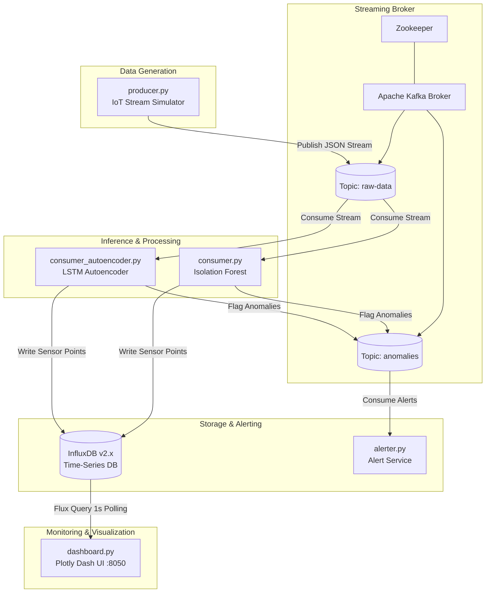

# ⚡ Real-Time Anomaly Detection on Streaming Data

An end-to-end, microservices-based distributed platform for detecting real-time anomalies in streaming IoT and time-series data. The system combines **Apache Kafka**, **Deep Learning (LSTM Autoencoders)**, **Machine Learning (Isolation Forest)**, **InfluxDB**, and a live **Plotly Dash** dashboard—fully containerized with **Docker & Docker Compose**.

---

## 📌 Table of Contents

- [System Architecture](#-system-architecture)
- [Key Features](#-key-features)
- [Tech Stack](#-tech-stack)
- [Repository Structure](#-repository-structure)
- [Detection Models Explained](#-detection-models-explained)
- [Prerequisites & Environment Configuration](#-prerequisites--environment-configuration)
- [Model Training](#-model-training)
- [Quick Start with Docker Compose](#-quick-start-with-docker-compose)
- [Switching Consumer Inference Engines](#-switching-consumer-inference-engines)
- [Live Dashboard & Visuals](#-live-dashboard--visuals)
- [Troubleshooting & Resilience](#-troubleshooting--resilience)

---

## 🏗 System Architecture



### End-to-End Pipeline Workflow
1. **Producer (`producer.py`)**: Simulates continuous IoT sensor telemetry (sine wave with realistic Gaussian noise) and periodically injects synthetic anomalies (sudden spikes, flatlines, and gradual contextual drift). Streams JSON payloads to the Kafka topic `raw-data`.
2. **Message Broker (`Kafka` & `Zookeeper`)**: Serves as the distributed streaming backbone decoupling producers, inference consumers, and alerting microservices.
3. **Inference Consumer (`consumer.py` or `consumer_autoencoder.py`)**: Consumes incoming raw telemetry, standardizes the payload, executes real-time inference, flags anomalies, and routes:
   - All enriched telemetry + anomaly tags to **InfluxDB**.
   - Anomaly events to the Kafka `anomalies` topic.
4. **Alerting Microservice (`alerter.py`)**: Subscribes to the `anomalies` topic to immediately log critical anomaly notifications.
5. **Real-Time Dashboard (`dashboard.py`)**: Periodically queries InfluxDB via Flux to render live interactive scatter/line telemetry, anomaly markers (`x`), and KPI counters on a responsive dark-themed Dash web app.

---

## ✨ Key Features

- **Distributed Microservices Architecture**: Decoupled producer, consumer, time-series storage, alerting, and visualization services.
- **Dual Anomaly Detection Strategies**:
  - **Statistical / Pointwise**: Scikit-Learn **Isolation Forest** for rapid outlier detection on tabular readings.
  - **Temporal / Contextual**: TensorFlow/Keras **LSTM Autoencoder** with a 20-step sliding window to detect sequence pattern distortions via reconstruction error (MAE).
- **Time-Series Persistence**: High-throughput writes and Flux-based queries via **InfluxDB 2.x**.
- **Live Reactive Dashboard**: Plotly Dash frontend updating every 1 second without full page reloads.
- **Resilient Network Connections**: Built-in exponential retry loops for Kafka brokers and InfluxDB readiness during startup.
- **Containerized Deployment**: Single-command orchestration via `docker-compose up --build`.

---

## 🛠 Tech Stack

| Domain | Technology |
| :--- | :--- |
| **Language** | Python 3.12 (Slim base container) |
| **Streaming & Pub/Sub** | Apache Kafka 7.3.0, Zookeeper, `kafka-python-ng` |
| **Machine Learning** | Scikit-Learn, Joblib, NumPy, Pandas |
| **Deep Learning** | TensorFlow 2.x / Keras (LSTM Autoencoder) |
| **Time-Series Database** | InfluxDB 2.9.1 (`influxdb-client`) |
| **Visualization & Web UI** | Plotly Dash, Dash Bootstrap Components (`dbc`) |
| **Containerization** | Docker, Docker Compose |

---

## 📂 Repository Structure

```text
.
├── .env                         # Environment variables (InfluxDB credentials & tokens)
├── Dockerfile                   # Unified Python 3.12 slim container image
├── docker-compose.yml           # Full multi-container service orchestration
├── requirements.txt             # Python runtime dependencies
├── producer.py                  # Generates normal & synthetic anomalous IoT sensor data
├── consumer.py                  # Isolation Forest stream consumer & InfluxDB writer
├── consumer_autoencoder.py      # LSTM Autoencoder stream consumer with sliding window
├── alerter.py                   # Alerting service listening to the 'anomalies' topic
├── dashboard.py                 # Plotly Dash live analytics UI
├── train_model.py               # Training script for Isolation Forest
├── train_autoencoder.py         # Training script for LSTM Autoencoder & threshold tuning
├── isolation_forest.joblib      # Serialized Isolation Forest model
├── scaler.joblib                # Serialized StandardScaler for Isolation Forest
├── lstm_autoencoder.h5          # Trained Keras LSTM Autoencoder weights
├── scaler_autoencoder.joblib    # Serialized StandardScaler for Autoencoder
└── threshold.json               # 99th-percentile reconstruction error threshold
```

---

## 🧠 Detection Models Explained

### 1. Classical Machine Learning: Isolation Forest (`train_model.py` / `consumer.py`)
- Fits an ensemble of Isolation Trees over normalized single-point sensor readings.
- Outliers are isolated closer to the root of trees, making it lightweight and fast for high-throughput point anomaly detection.

### 2. Deep Learning: LSTM Autoencoder (`train_autoencoder.py` / `consumer_autoencoder.py`)
- **Encoder**: Compresses a sequence of $T=20$ time steps using stacked LSTM layers (`LSTM(128) -> LSTM(64)`).
- **Bridge & Decoder**: `RepeatVector(20)` replicates the latent representation and reconstructs the original sequence via `LSTM(64) -> LSTM(128) -> TimeDistributed(Dense(1))`.
- **Inference Logic**:
  - Maintains an in-memory FIFO sliding window (`collections.deque(maxlen=20)`).
  - Calculates the Reconstruction Mean Absolute Error:
    $$\text{MAE} = \frac{1}{T}\sum_{t=1}^{T} |x_t - \hat{x}_t|$$
  - Compares the MAE against the pre-calculated 99th-percentile validation threshold (`threshold.json`). If $\text{MAE} > \text{threshold}$, an anomaly is flagged.

---

## ⚙️ Prerequisites & Environment Configuration

### Prerequisites
- [Docker Desktop](https://www.docker.com/products/docker-desktop/) (macOS, Linux, or Windows)
- [Git](https://git-scm.com/)
- Python 3.12+ (optional, only if running local training scripts outside Docker)

### Environment Configuration (`.env`)
Create or verify the `.env` file in the project directory:

```env
INFLUX_TOKEN=your-super-secret-admin-token-64-chars-long
INFLUX_PASSWORD=your_secure_password
```

These values are automatically injected into `docker-compose.yml` for InfluxDB authentication and client connections.

---

## 🏋️‍♂️ Model Training

Pre-trained model artifacts are included in the repository. If you wish to retrain them from scratch with new parameters:

```bash
# 1. Create and activate a virtual environment
python3 -m venv venv
source venv/bin/activate

# 2. Install dependencies
pip install -r requirements.txt

# 3. Train the Isolation Forest model
python train_model.py
# Outputs: isolation_forest.joblib, scaler.joblib

# 4. Train the LSTM Autoencoder model
python train_autoencoder.py
# Outputs: lstm_autoencoder.h5, scaler_autoencoder.joblib, threshold.json
```

---

## 🚀 Quick Start with Docker Compose

### 1. Build and Start All Services
From the `realtime-anomaly-detection` directory, run:

```bash
docker-compose up --build -d
```

### 2. Verify Running Containers
```bash
docker-compose ps
```

You should see all core services running:
- `zookeeper` (port `2181`)
- `kafka` (ports `9092`, `29092`)
- `influxdb` (port `8086`)
- `producer`
- `consumer_autoencoder` (or `consumer`)
- `alerter`
- `dashboard` (port `8050`)

### 3. Inspect Service Logs
```bash
# View real-time consumer anomaly predictions
docker-compose logs -f consumer_autoencoder

# View real-time alert triggers
docker-compose logs -f alerter
```

### 4. Open the Web Dashboard
Navigate to **[http://localhost:8050](http://localhost:8050)** in your browser to view the live dashboard.

### 5. Stop the Application
```bash
docker-compose down
```

---

## 🔄 Switching Consumer Inference Engines

In `docker-compose.yml`, you can switch between the **Isolation Forest Consumer** and the **LSTM Autoencoder Consumer**:

To run the **Isolation Forest** consumer:
1. Uncomment the `consumer:` block in `docker-compose.yml`.
2. Comment out the `consumer_autoencoder:` block.
3. Restart via `docker-compose up -d`.

To run the **LSTM Autoencoder** consumer (default):
1. Keep `consumer_autoencoder:` active in `docker-compose.yml`.
2. Ensure `consumer:` is commented out.

---

## 📊 Live Dashboard & Visuals

The Plotly Dash interface connects to InfluxDB and displays:
- **Live Sensor Telemetry**: Continuous real-time time-series stream.
- **Anomaly Annotations**: Instant highlighted red cross markers (`X`) on anomalous data points.
- **KPI Summary Card**: Live aggregate counter of total detected anomalies over the rolling time window.

*(UI snapshots and execution logs can be found in the `final-output/` directory)*

---

## 🛡️ Troubleshooting & Resilience

| Issue | Cause | Solution |
| :--- | :--- | :--- |
| `NoBrokersAvailable` on startup | Kafka takes several seconds to initialize after Zookeeper | The Python services include automated retry loops (`time.sleep(5)`). They will automatically reconnect once Kafka is ready. |
| InfluxDB Health Check Fails | Database setup still initializing | Verify that `INFLUX_TOKEN` and `INFLUX_PASSWORD` in `.env` match the compose variables. |
| Dashboard shows "Waiting for data..." | InfluxDB has not received any points in the last 5 minutes | Check `docker-compose logs producer` and `docker-compose logs consumer_autoencoder` to verify data flow. |
